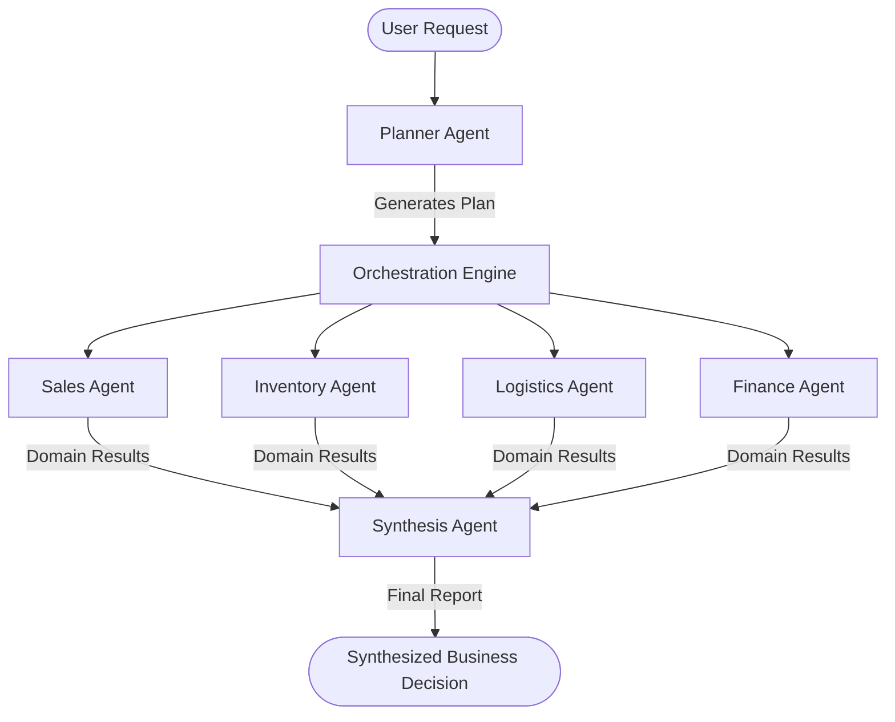

# Multi-Agent Decision Engine: Agent and Tool Documentation

This document provides a comprehensive guide to the agent architecture, inputs/outputs, and tool specifications of the Enterprise Multi-Agent Decision System.

---

## 1. System Overview

The system uses a **Plan-Execute-Synthesize** pattern to coordinate multiple domain-specific agents and generate cohesive enterprise-level business decisions from complex user requests.



---

## 2. Planner Agent

The **Planner Agent** acts as the dispatcher. It breaks down the high-level business query into individual sub-tasks for the specialized domain agents.

*   **Role**: Analyze the user's business request and construct a multi-agent execution plan.
*   **Inputs**: 
    *   `request` (str): The raw business request/query from the user.
*   **Outputs**:
    *   `plan` (JSON/dict): An execution plan listing which domain agents should run, their custom instructions, and the target parameters.
    *   *Example Output Structure*:
        ```json
        {
          "tasks": [
            {
              "agent": "SalesAgent",
              "task": "Analyze Q3 demand growth and propose target sales goals.",
              "parameters": {}
            },
            {
              "agent": "FinanceAgent",
              "task": "Verify if a $50k budget increase for marketing is financially viable.",
              "parameters": {}
            }
          ]
        }
        ```

---

## 3. Domain Agents

Domain agents are specialized LLM agents equipped with specific domain tools. They receive their instructions and execute tools asynchronously using the ADK framework.

### 3.1 Sales Agent
*   **Role**: Responsible for analyzing sales histories, forecasting demand, calculating growth, and recommending production levels.
*   **Agent Input**: Custom task instruction delegated by the Planner Agent.
*   **Tools**:
    
    #### `fetch_sales_data`
    *   **Description**: Fetches historical monthly sales data.
    *   **Inputs**: None
    *   **Returns**: `List[Dict]` containing monthly dates and sales quantities.
        ```json
        [
          {"date": "2025-01", "sales": 2200},
          {"date": "2025-02", "sales": 2350},
          {"date": "2025-03", "sales": 2400}
        ]
        ```

    #### `forecast_demand`
    *   **Description**: Forecasts future demand based on sales trends.
    *   **Inputs**: None
    *   **Returns**: `Dict` containing the forecasted sales quantity and confidence score.
        ```json
        {
          "forecast": 2650,
          "confidence": 0.93
        }
        ```

    #### `calculate_growth`
    *   **Description**: Calculates growth trends based on sales analytics.
    *   **Inputs**: None
    *   **Returns**: `Dict` containing the growth percentage.
        ```json
        {
          "growth": 18.2
        }
        ```

    #### `recommend_production`
    *   **Description**: Evaluates current capacity vs. forecasted demand to recommend production target changes.
    *   **Inputs**: None
    *   **Returns**: `str` representing the production guidance (e.g., `"Increase production by 12%"`).

---

### 3.2 Inventory Agent
*   **Role**: Responsible for monitoring stock levels, measuring warehouse capacities, determining stock optimization targets, and providing reordering advice.
*   **Agent Input**: Custom task instruction delegated by the Planner Agent.
*   **Tools**:

    #### `fetch_inventory`
    *   **Description**: Fetches current inventory data from the warehouse.
    *   **Inputs**: None
    *   **Returns**: `Dict` containing current stock, maximum capacity, and safety stock levels.
        ```json
        {
          "current_stock": 1200,
          "warehouse_capacity": 2000,
          "safety_stock": 300
        }
        ```

    #### `optimize_inventory`
    *   **Description**: Calculates optimal inventory stock levels.
    *   **Inputs**: None
    *   **Returns**: `Dict` containing recommended optimal stock level.
        ```json
        {
          "recommended_stock": 1400
        }
        ```

    #### `warehouse_capacity`
    *   **Description**: Measures current warehouse utilization percentage.
    *   **Inputs**: None
    *   **Returns**: `Dict` containing current capacity utilization percentage.
        ```json
        {
          "utilization": 94
        }
        ```

    #### `reorder_recommendation`
    *   **Description**: Evaluates whether additional inventory should be reordered.
    *   **Inputs**: None
    *   **Returns**: `str` representing the reorder guidance (e.g., `"Order 350 units"` or `"Delay purchasing"`).

---

### 3.3 Logistics Agent
*   **Role**: Analyzes shipment lists, estimates delivery times, determines optimal routing, and computes warehouse assignments.
*   **Agent Input**: Custom task instruction delegated by the Planner Agent.
*   **Tools**:

    #### `fetch_shipments`
    *   **Description**: Retrieves a list of active shipments.
    *   **Inputs**: None
    *   **Returns**: `List[Dict]` representing current shipment statuses and routes.
        ```json
        [
          {"id": "ship001", "origin": "Warehouse A", "destination": "Store X", "status": "in_transit"},
          {"id": "ship002", "origin": "Warehouse B", "destination": "Store Y", "status": "delivered"}
        ]
        ```

    #### `optimize_routes`
    *   **Description**: Calculates the optimal delivery route.
    *   **Inputs**: None
    *   **Returns**: `Dict` containing the ordered route list and total distance.
        ```json
        {
          "best_route": ["Warehouse A", "Store X", "Warehouse B", "Store Y"],
          "total_distance_km": 120
        }
        ```

    #### `delivery_eta`
    *   **Description**: Calculates estimated delivery duration and risk of delays.
    *   **Inputs**: None
    *   **Returns**: `Dict` containing estimated hours and delay probability.
        ```json
        {
          "estimated_delivery_hours": 24,
          "delay_probability": 0.15
        }
        ```

    #### `warehouse_assignment`
    *   **Description**: Assigns the optimal distribution warehouse for the shipment.
    *   **Inputs**: None
    *   **Returns**: `Dict` representing the recommended warehouse.
        ```json
        {
          "recommended_warehouse": "Warehouse B"
        }
        ```

---

### 3.4 Finance Agent
*   **Role**: Responsible for managing operating budgets, detecting spending anomalies, estimating expenses, and calculating total budget impact.
*   **Agent Input**: Custom task instruction delegated by the Planner Agent.
*   **Tools**:

    #### `fetch_budget`
    *   **Description**: Fetches departmental budgets and current spending levels.
    *   **Inputs**: None
    *   **Returns**: `Dict` mapping departments to their budget and spending values.
        ```json
        {
          "department_budgets": {
            "sales": 500000,
            "inventory": 300000,
            "finance": 200000,
            "logistics": 250000
          },
          "current_spending": {
            "sales": 450000,
            "inventory": 280000,
            "finance": 180000,
            "logistics": 220000
          }
        }
        ```

    #### `anomaly_detection`
    *   **Description**: Audits transactions for abnormal spending patterns.
    *   **Inputs**: None
    *   **Returns**: `Dict` containing an anomaly flag and confidence score.
        ```json
        {
          "anomaly": false,
          "score": 0.12
        }
        ```

    #### `cost_estimator`
    *   **Description**: Estimates additional costs associated with operational expansion or change.
    *   **Inputs**: None
    *   **Returns**: `Dict` containing the estimated extra cost.
        ```json
        {
          "extra_cost": 120000
        }
        ```

    #### `budget_impact`
    *   **Description**: Computes overall budget headroom, cash flow status, and whether spending limits will be exceeded.
    *   **Inputs**: None
    *   **Returns**: `Dict` containing exceedance flag, remaining budget, and cash flow status.
        ```json
        {
          "budget_exceeded": false,
          "remaining_budget": 50000,
          "cashflow": "positive"
        }
        ```

---

## 4. Synthesis Agent

The **Synthesis Agent** resolves contradictions and merges the individual domain results into a single final business decision.

*   **Role**: Analyze the user request alongside the responses generated by the domain agents to deliver a unified enterprise recommendation.
*   **Inputs**:
    *   `request` (str): Original user request.
    *   `agent_results` (Dict[str, str]): Key-value pairs containing the final textual results of each executed domain agent.
*   **Outputs**:
    *   `synthesis` (str): A structured synthesis report covering:
        1.  **Overall Situation**: High-level context.
        2.  **Key Findings**: Major observations from domain agents.
        3.  **Agent Recommendations**: Individual recommendations.
        4.  **Conflicting Recommendations**: Any logical or resource constraints (e.g. Sales wants to increase production, but Finance warns budget limit exceeded).
        5.  **Recommended Action**: Final action plan.
        6.  **Risks**: Associated risks.
        7.  **Overall Confidence**: A metric value reflecting decision certainty.
